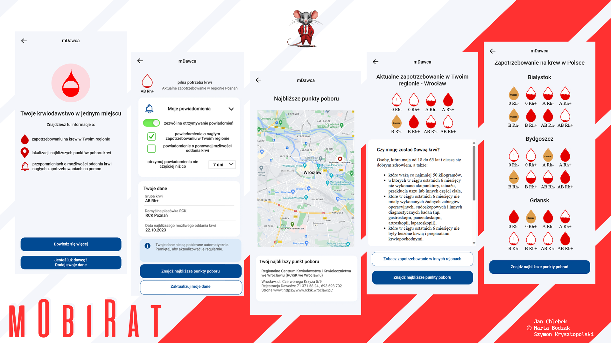

# mDawca - system for monitoring blood demand, reminding blood donors and reaching in case of an emergency in Poland

As part of the mHack - 24 hour (of coding) hackathon organized by the Polish Ministry of Digital Affairs and COI, we've had a pleasure of proposing and implementing a pilot of a system for monitoring blood demand, reminding blood donors and reaching in case of an emergency in Poland.

The project was awarded 3rd place, with points deducted primarily due to the limitations of accessing the data (government API is still being developed). The organizers have expressed their willingness to purchase the copyright from us - we hope that our idea will see the light of day in the future and be put to use for all Polish people!

The solution is based on Java17, React 18, PostgreSQL and Docker technologies. The whole project was build upon self-created mockups.

Project team:
* [Jan Chlebek](https://www.linkedin.com/in/jan-chlebek/) - Idea, PO and presentation, UI/UX mocking, frontend
* [Marta Bodzak](https://www.linkedin.com/in/marta-bodzak/) - Frontend
* [Szymon Krysztopolski](https://www.linkedin.com/in/szymon-krysztopolski/) - Backend & Data

© Jan Chlebek, Marta Bodzak, Szymon Krysztopolski
